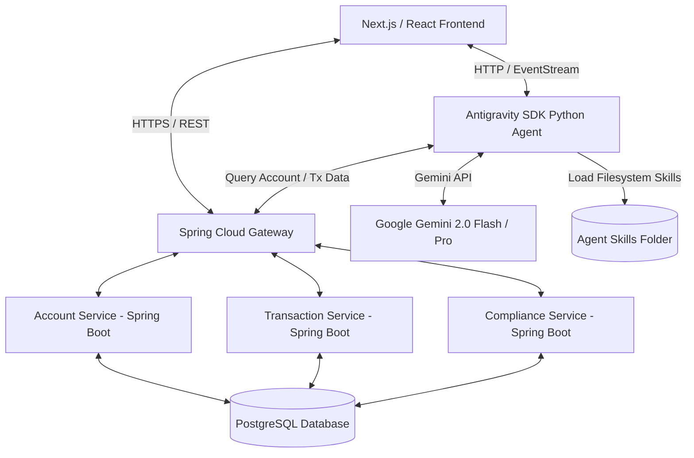
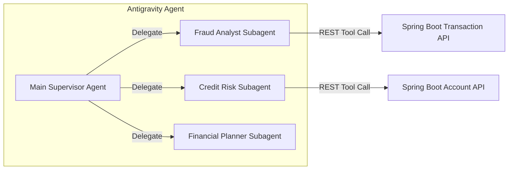

# System Architecture — ApexBank Agentic Platform

## High-Level System Overview
ApexBank Agentic Platform consists of a modern, multi-tier system combining microservices, an agentic AI engine, and a frontend dashboard.



---

## 1. Backend Microservices (Java/Spring Boot)
The core ledger and banking data model are implemented as Spring Boot microservices running on Java 21:
- **Account Service**: Manages customer profiles, account balances, savings/checking parameters, and credit limits.
- **Transaction Service**: Processes deposits, withdrawals, and bank-to-bank transfers. Publishes transaction logs and flags velocity thresholds.
- **Compliance Service**: Stores risk profiles and compliance rules. Records regulatory reports and flags suspicious accounts.

### Tech Stack
- **Language**: Java 21
- **Framework**: Spring Boot 3.x
- **Build Tool**: Maven (or Gradle)
- **Data Access**: Spring Data JPA / Hibernate
- **Database**: PostgreSQL (multi-tenant or shared schema with row-level segregation)
- **Testing**: JUnit 5, Mockito, AssertJ, WebTestClient
- **Monitoring**: Spring Boot Actuator, Prometheus metrics

---

## 2. Agentic AI Engine (Google Antigravity SDK)
The intelligent auditing and decision-making engine is built in Python using the Google Antigravity SDK.



### Components
- **Main Supervisor Agent**: Directs incoming requests from the frontend or scheduler. Determines which subagent to launch using standard Antigravity delegation.
- **Fraud Analyst Subagent**: Specialized in analyzing transaction patterns, detecting geographical hops, velocity changes, and drafting fraud dossiers.
- **Credit Risk Subagent**: Reads uploaded financial documents and recommends deposit and credit limits.
- **Financial Planner Subagent**: Helps retail users set savings plans based on their ledger history.

### SDK Features Leveraged
- **LocalAgentConfig**: Configures models, connection overrides, and skill loading.
- **Filesystem Skills Directory**: Configures `skills_paths` pointing to the `/skills` folder containing `architect`, `scope`, `develop`, `check`, `test`, `audit`, `debug`, `document`, `sync`, and customized banking skills.
- **AskQuestionHook / Event Hooks**: Allows the agent to pause execution and prompt a compliance officer for confirmations during high-risk steps.
- **Structured Outputs**: Forces agents to return risk assessments and reports matching strict JSON Pydantic schemas.

---

## 3. Database Schema
PostgreSQL is used as the relational database engine. Below are the key tables:

### `accounts` Table
Stores customer core balances and profile details.
```sql
CREATE TABLE accounts (
    id VARCHAR(50) PRIMARY KEY,
    owner_name VARCHAR(100) NOT NULL,
    email VARCHAR(100) UNIQUE NOT NULL,
    account_type VARCHAR(20) NOT NULL, -- 'CHECKING', 'SAVINGS'
    balance DECIMAL(15, 2) DEFAULT 0.00,
    credit_limit DECIMAL(15, 2) DEFAULT 0.00,
    deposit_limit DECIMAL(15, 2) DEFAULT 1000.00,
    risk_level VARCHAR(20) DEFAULT 'LOW', -- 'LOW', 'MEDIUM', 'HIGH'
    created_at TIMESTAMP DEFAULT CURRENT_TIMESTAMP
);
```

### `transactions` Table
Logs all deposit, withdrawal, and transfer records.
```sql
CREATE TABLE transactions (
    id VARCHAR(50) PRIMARY KEY,
    account_id VARCHAR(50) REFERENCES accounts(id),
    amount DECIMAL(15, 2) NOT NULL,
    tx_type VARCHAR(20) NOT NULL, -- 'DEPOSIT', 'WITHDRAWAL', 'TRANSFER'
    merchant_name VARCHAR(100),
    merchant_location VARCHAR(100),
    status VARCHAR(20) DEFAULT 'COMPLETED', -- 'PENDING', 'COMPLETED', 'FLAGGED'
    created_at TIMESTAMP DEFAULT CURRENT_TIMESTAMP
);
```

### `compliance_reports` Table
Stores AI-generated compliance audit reports and Suspicious Activity Reports (SARs).
```sql
CREATE TABLE compliance_reports (
    id VARCHAR(50) PRIMARY KEY,
    account_id VARCHAR(50) REFERENCES accounts(id),
    risk_score INT NOT NULL, -- 0 to 100
    reasoning TEXT NOT NULL,
    actions_taken VARCHAR(100), -- 'AUTO_FREEZE', 'MONITOR', 'NONE'
    drafted_sar TEXT, -- Markdown format
    created_at TIMESTAMP DEFAULT CURRENT_TIMESTAMP
);
```

### `agent_runs` Table
Tracks execution statistics for the Antigravity Agent.
```sql
CREATE TABLE agent_runs (
    id VARCHAR(50) PRIMARY KEY,
    agent_type VARCHAR(50) NOT NULL,
    trigger_type VARCHAR(20) NOT NULL, -- 'MANUAL', 'SCHEDULED'
    status VARCHAR(20) NOT NULL, -- 'RUNNING', 'COMPLETED', 'FAILED'
    tokens_used INT DEFAULT 0,
    thinking_tokens_used INT DEFAULT 0,
    created_at TIMESTAMP DEFAULT CURRENT_TIMESTAMP,
    completed_at TIMESTAMP
);
```

---

## 4. Frontend Dashboard (React / Next.js)
A modern, single-page application built on Next.js 14+ / TypeScript, communicating with the gateway and the Python agent:
- **Dashboard Views**: Real-time transaction feed, account summaries, compliance officer queue.
- **Audit Console**: A specialized screen displaying the interactive terminal loop. Streams thoughts (Gemini reasoning processes) and logs. Shows active safety policies and tool calls.
- **Asset Viewer**: An interface to view generated PDF compliance reports or CSV transaction logs.

---

## 5. Security & Isolation boundary
- **Read-Only Agent Permissions**: The Antigravity agent has read-only access to transaction history, and can only write to `compliance_reports` via the Spring Boot API. It cannot directly initiate withdrawals or change account ownership.
- **API Token Verification**: All microservice communication is protected by JWT validation, preventing unauthorized agent action or customer data exposure.
- **Local sandbox**: All LLM runs operate inside isolated Python environments, with strict file access limits restricted to the workspace `/scratch` directory.
