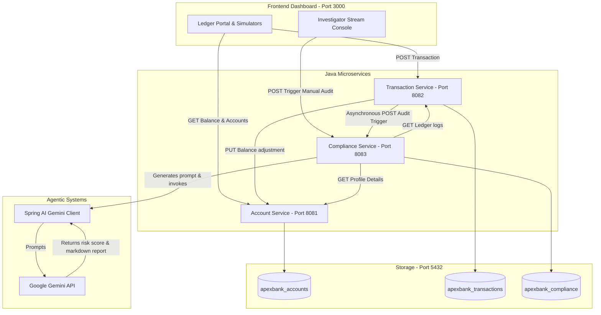

# ApexBank Platform Guide

This document explains the architecture of the ApexBank Agentic Platform. It details how the separate parts interact and provides a complete map of the system flows.

---

## 1. System Components

The platform consists of six main parts. Each part runs in its own environment (as containers or local processes) and communicates using REST calls.

### A. Database (PostgreSQL)
A single database instance hosting three separate databases:
* `apexbank_accounts`: Stores user profile data and credit limits.
* `apexbank_transactions`: Stores ledger records (deposits, withdrawals, transfers).
* `apexbank_compliance`: Stores AI Generated compliance audits and reports.

### B. Account Service (Java Spring Boot)
Runs on port `8081`. It manages user profiles, balances, and transaction limits.

### C. Transaction Service (Java Spring Boot)
Runs on port `8082`. It handles ledger updates. When a new transaction is posted, this service calls the Account Service to adjust the balance. If a transaction exceeds $10,000, it marks the transaction status as `FLAGGED`.

### D. Compliance Service (Java Spring Boot)
Runs on port `8083`. It serves as the compliance vault. In the new design, this service integrates with Spring AI and Google Gemini to run audits and draft Suspicious Activity Reports (SARs).

### E. Frontend Dashboard (Next.js React TypeScript)
Runs on port `3000`. It provides a premium visual workspace. Compliance officers use this dashboard to view ledger logs, select accounts, trigger manual AI audits, and view generated reports.

### F. Python Antigravity Agent
Runs as a CLI tool. It leases the Antigravity Agent to run audits using filesystem skills and local Python tools.

---

## 2. Platform Architecture Diagram

The flowchart below shows how all the parts connect and interact during execution:

---

## 3. Core Execution Flows

### Flow A: Automated Transaction Flag & Audit Trigger
1. A user posts a transaction exceeding $10,000 to the Transaction Service.
2. The Transaction Service processes the ledger entry and saves it with a `FLAGGED` status in `apexbank_transactions`.
3. The Transaction Service sends an asynchronous REST trigger to the Compliance Service.
4. The Compliance Service fetches the target account details and transaction history.
5. The Compliance Service builds the audit prompt and invokes the Gemini model using Spring AI.
6. The Gemini model returns a calculated risk score (between 0 and 100) and a markdown Suspicious Activity Report (SAR).
7. The Compliance Service applies the hold action (AUTO_FREEZE if risk is 80 or above, MONITOR if risk is 50 or above) and saves the report to `apexbank_compliance`.

### Flow B: Manual Officer Audit Trigger
1. An officer clicks "Trigger AI Security Audit" on the frontend dashboard.
2. The frontend sends a POST request to `/api/compliance/reports/audit/{accountId}` on the Compliance Service.
3. The Compliance Service executes steps 4 to 6 from Flow A.
4. The generated compliance report is returned to the dashboard and displayed in the terminal stream window.
